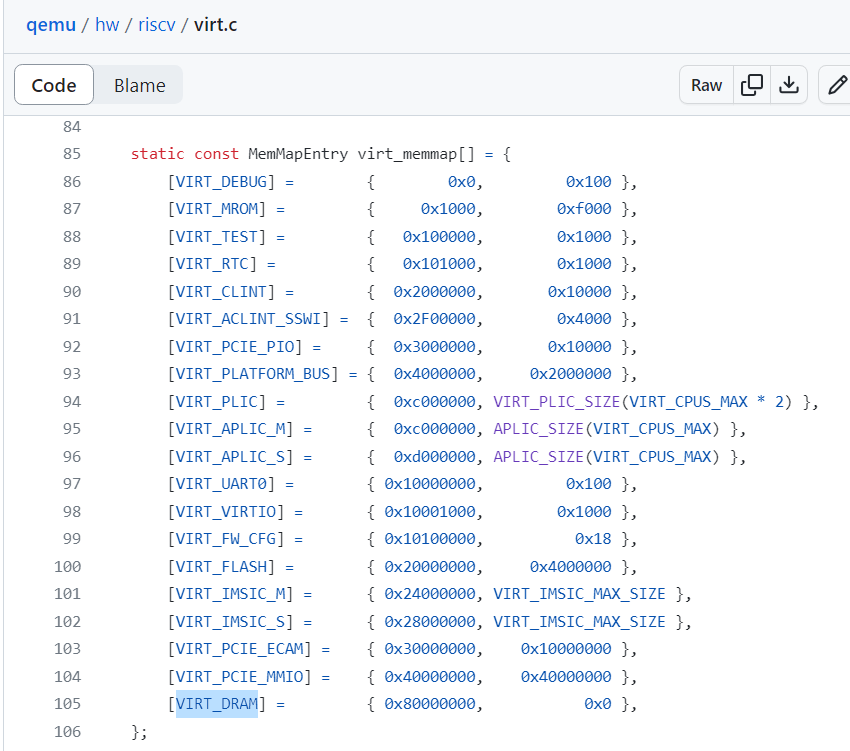

#### 练习1：理解 First-fit 连续物理内存分配算法（思考题）

- default_init()函数：完成空闲链表的初始化工作
- default_init_memmap()函数：完成初始空闲链表块的分配
- default_alloc_pages()函数：按照First-fit算法分配连续页面
- default_free_pages()函数：释放页面，与前后连续空闲页面合并
- 进一步改进的空间：优化管理空闲链表的数据结构，可采用红黑树减少分配页面时间

#### 练习2：实现 Best-Fit 连续物理内存分配算法（需要编程）

- 实现Best-fit同First-fit的区别在于分配页面的时候，是分配第一次符合要求的页面还是最符合要求的页面
- 改进空间：同First-fit

#### 扩展练习Challenge：硬件的可用物理内存范围的获取方法（思考题）

通过查看 QEMU 代码中 [hw/riscv/virt.c](https://github.com/qemu/qemu/blob/master/hw/riscv/virt.c) 的 `virt_memmap[]` 的定义，可以了解到 QEMU 模拟的 RISC-V Virt 计算机的详细物理内存布局，其中VIRT_DRAM通过OpenSBI调用一些接口可以知道物理地址范围，在Qemu中通过-m指定内存大小。

